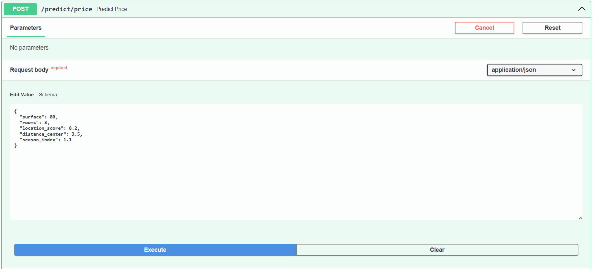
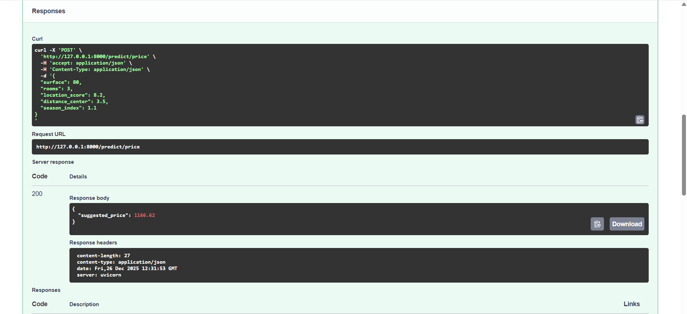
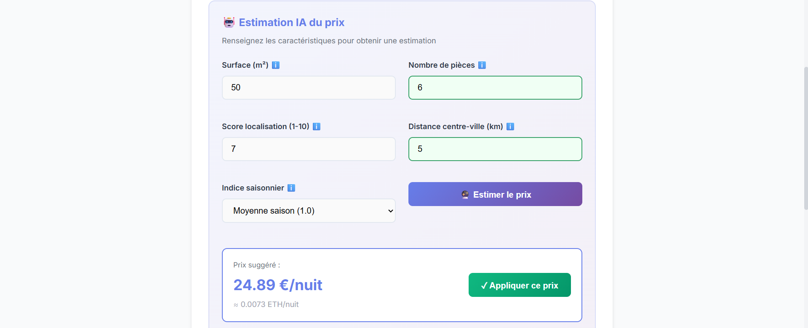
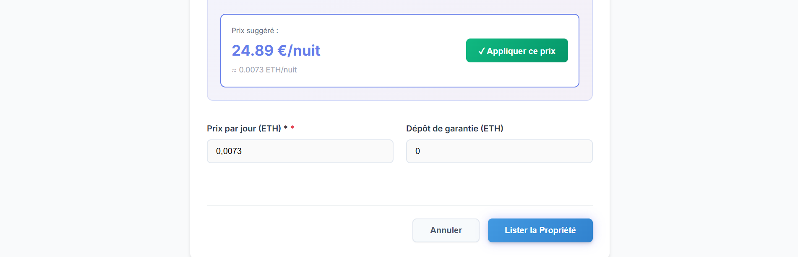

# Projet JEE – Rôle IA & Data Analyst (Microservice ML)

## 1. Présentation générale

Ce projet s’inscrit dans une architecture **microservices** combinant :

- **Backend Spring Boot (JEE)**
- **Microservice IA / Machine Learning (FastAPI)**
- **Frontend Angular**
- **Blockchain (on-chain)**
- **Intelligence Artificielle off-chain**

Le rôle **AI & Data Analyst** a pour objectif d’exploiter les données immobilières **off-chain** afin de fournir des services intelligents à forte valeur ajoutée, tout en respectant les contraintes de coût et de performance liées à la blockchain.

**Remarque** : L’IA n’est jamais exécutée on-chain, mais exposée via un **microservice ML indépendant**, consommé par le backend Spring Boot via des API REST.

---

## 2.  Objectifs du rôle IA

- Exploiter les données locatives réelles
- Concevoir, entraîner et évaluer des modèles de Machine Learning
- Déployer les modèles sous forme de microservice **FastAPI**
- Fournir des prédictions en temps réel via des **API REST**
- Garantir une séparation claire **on-chain / off-chain**
- Assurer la scalabilité et la maintenabilité du système

---

## 3.  Responsabilités – AI & Data Analyst / ML Engineer

- Analyse des données immobilières (prix, localisation, locataires, historique)
- Sélection et entraînement de modèles ML adaptés
- Évaluation des performances (metrics, validation, tuning)
- Déploiement des modèles en production (microservice ML)
- Intégration avec les microservices Spring Boot
- Respect de l’architecture décentralisée (blockchain + IA off-chain)

---

## 4. Fonctionnalités Machine Learning

### a. Dynamic Rental Price Suggestion

**Objectif :**  
Suggérer un prix de location optimal basé sur le marché réel.

**Modèles utilisés :**
- GradientBoostingRegressor
- XGBoost (optionnel)

**Features possibles :**
- Localisation
- Surface
- Nombre de chambres
- Saison
- Historique des prix du quartier

**Valeur métier :**
> +8 % à +15 % de rendement locatif estimé

---

### b. Tenant Risk Scoring

**Objectif :**  
Attribuer un score de confiance au locataire (0–100).

**Modèles utilisés :**
- RandomForestClassifier
- Gradient Boosted Trees

**Données exploitées :**
- Retards de paiement
- Litiges passés
- Durée moyenne des locations

**Valeur métier :**
> Réduction significative du risque pour les propriétaires

---

### c. Property Recommendation Engine

**Objectif :**  
Recommander des biens immobiliers adaptés au profil du locataire.

**Techniques utilisées :**
- K-Means (clustering des biens)
- Cosine Similarity (matching utilisateur ↔ biens)

**Valeur métier :**
> Meilleure expérience utilisateur et taux de conversion plus élevé

---

### d. Market Trend Dashboard (optionnel)

**Objectif :**  
Visualiser les tendances du marché immobilier par zone.

**Méthodes :**
- Analyse de séries temporelles (off-chain)
- Clustering temporel

**Outils de visualisation :**
- Plotly
- Seaborn

---

## 5.  Architecture ML

### Pourquoi un microservice ML séparé ?

- Scalabilité indépendante
- Aucun couplage avec la blockchain
- Modèles lourds (non adaptés au on-chain)
- Facilement containerisable (Docker, Kubernetes)
- Compatible CI/CD

---

### 🔁 Flux d’intégration global
```
Angular Frontend
↓
Spring Boot Backend
↓ REST API
FastAPI ML Service
↓
Prédictions / Scores / Recommandations
```

Le backend reste **maître de la logique métier**  
Le ML fournit uniquement des **résultats prédictifs**

---

## 6.  Structure du microservice ML
```
ml-service/
├── app/ # Microservice FastAPI (ONLINE)
│ ├── main.py
│ └── models/ # Modèles entraînés (.pkl)
│ ├── price_model.pkl
│ ├── risk_model.pkl
│ └── recommend_model.pkl 
│ └── recommend_model_scaler.pkl

├── training/ # Entraînement OFFLINE
│ ├── data/
│ │ ├── rentals.csv
│ │ ├── tenants.csv
│ │ └── properties.csv
│ │
│ ├── train_price_model.py
│ ├── train_risk_model.py
│ └── train_recommend_model.py
│
├── requirements.txt
└── Dockerfile
```

### Justification technique

- `.pkl` → modèles entraînés hors production
- **FastAPI** → faible latence, simple à déployer
- Séparation stricte :
  - **Offline training**
  - **Online inference**
- Compatible DevOps & Kubernetes

---

## 7. Fonctionnement du Machine Learning

###  a. Entraînement (Offline)
CSV (data) → Scripts d’entraînement → Modèles .pkl


- Les données sont simplifiées (jeu de test)
- Les modèles sont générés automatiquement après entraînement

---

### b. Inférence (Online)
JSON → FastAPI → Modèles .pkl → Réponse JSON

- Les endpoints **ne lisent jamais les CSV en temps réel**  
- Ils utilisent uniquement les modèles déjà entraînés

---

## 8.  Endpoints ML (FastAPI)

Outils : **Swagger UI** sur http://127.0.0.1:8000/docs


### Exemples d’API

- `POST /predict/price` → Suggestion de prix
- `POST /predict/risk` → Score de confiance
- `POST /recommend` → Biens recommandés

Les réponses sont retournées en **JSON**  






Exemple : `1166.62 Euro` comme prix suggéré

---

## 9. Intégration avec le reste du projet

Le backend Spring Boot consomme le microservice ML :

POST http://ml-service:8000/predict/price

POST http://ml-service:8000/predict/risk

POST http://ml-service:8000/recommend


Le backend :
- Applique la logique métier
- Applique les règles blockchain / smart contracts

À noter que **Le ML est un fournisseur d’intelligence, pas un décideur**

---

## 10. Résumé global
```
CSV → Entraînement OFFLINE → Modèles .pkl
→ FastAPI (ONLINE)
→ Backend Spring Boot
→ Frontend Angular
→ Utilisateur final
```
#### Exemple d'utilisation (prédiction du prix dans la partie publication d'une nouvelle propriété)
- Information sur la propriété à louer 



- Prédiction du prix par nuit : on peut appliquer ce prix si cela nous convient, sinon, on ajoute notre propre prix.



---

## 11. Conclusion

Ce projet démontre une intégration réaliste et professionnelle du **Machine Learning dans une architecture JEE moderne**, respectant les contraintes de la blockchain tout en apportant une réelle valeur métier grâce à l’IA off-chain.

Il met en évidence :
- Une séparation claire des responsabilités
- Une architecture scalable et maintenable
- Une utilisation pertinente du ML dans un contexte réel

---

##  Auteur

**RAHELIARISOA Andriamasy Lorraine Agnès**  
 Deuxième année – Cycle Ingénieur  
 Filière : **LSI (Logiciels et Systèmes Intelligents)**  à la Faculté des Sciences et Techniques de Tanger

###  Encadrement

Encadré par : **Professeur Lotfi EL AACHAK**

---

